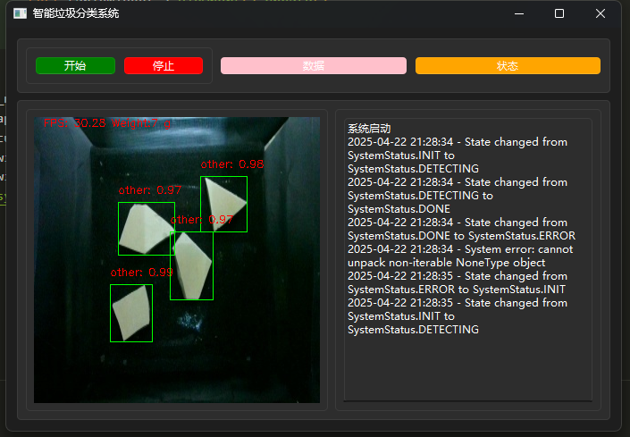
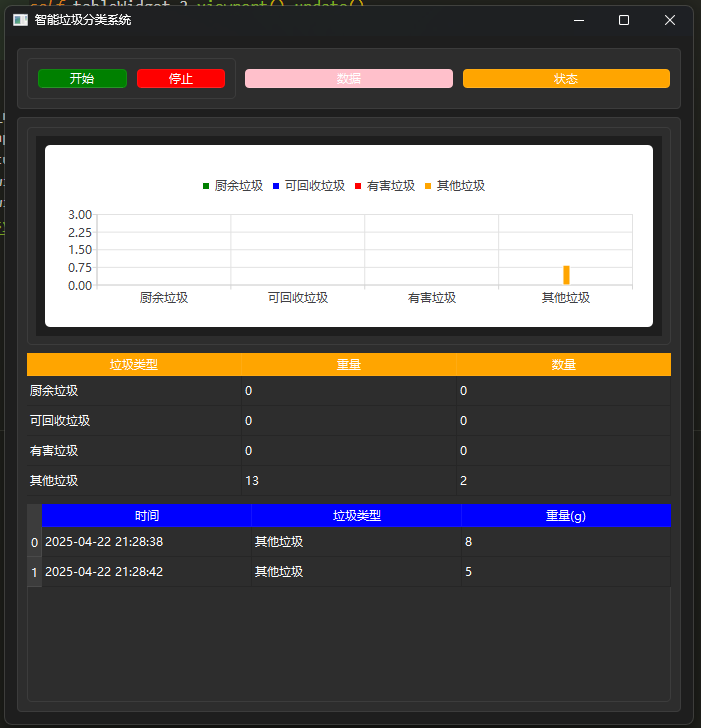

## 毕设的智能垃圾分类系统上位原型设计

- component
  - sensor system
  - motor system
  - led system
  - infrared system
  - vision detect system
  - uishow: the ui displays the relevant information storage
  - system state machine
  - user interface

- demo start

```python
python main.py
```

- requiremets: `requirements.txt`


## Interface:Pyside6




